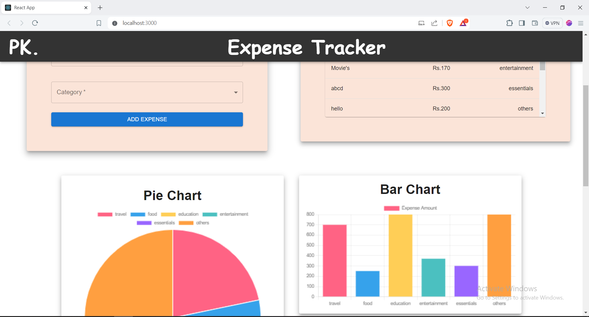

# Expense Tracker

This is a project for tracking expenses.

## Features

- Add expenses with description, amount, and category.
- View a list of expenses.
- Analyze expenses.

## Screenshot



## Getting Started

To get started with the project, follow these steps:

1. Clone the repository:
    ```bash
    git clone https://github.com/your-username/your-repository.git
    ```
2. Install dependencies:
    ```bash
    cd your-repository
    npm install
    ```
3. Start the development server:
    ```bash
    npm start
    ```
## Start the backend
cd my-expence
<br>
node index.js

## Start the Application
npm start


## License

This project is licensed under the MIT License.


## Start the backend
cd my-expence
<br>
node index.js

